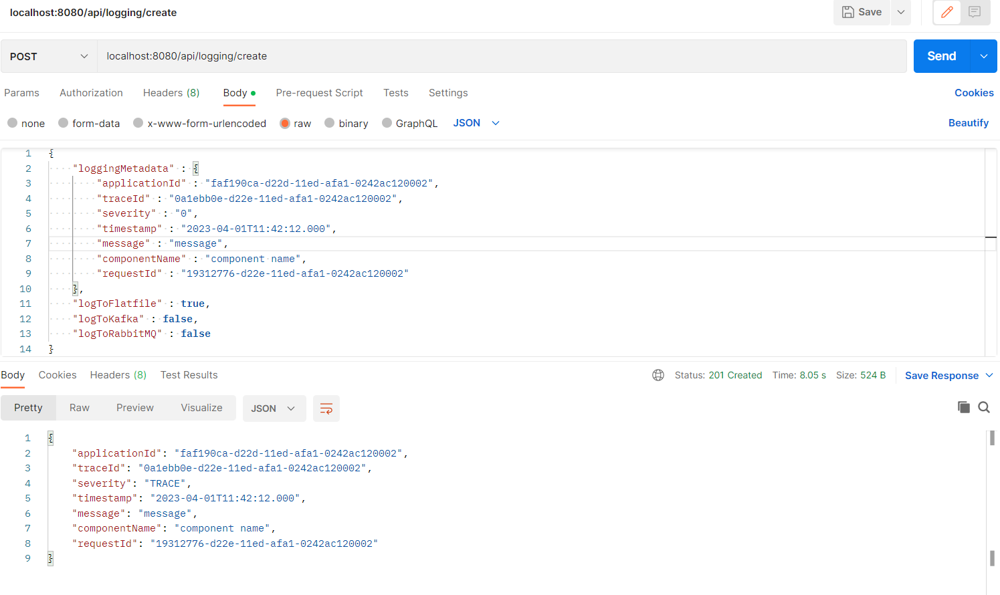

# Logging application

This application is currently not deployed or hosted anywhere.

The application is a RESTful API service which supports logging to the following:
- Flat file (.log file(s) located in ``.\logs\ ``)
- Kafka topic
- RabbitMQ topic

*****

## Table of contents

- [How to run](#howtorun)
- [Architecture](#architecture)
- [Future work](#futurework)
- [Demo](#demo)

*****

<a name="howtorun"></a>
## How to run

**Prerequisites**
- Java v11 with SpringBoot 3
- Maven
- Kafka
- RabbitMQ

Install Dependencies with Maven:

```console
project@root:~$ mvn clean install
```

Build the application with Maven:

```console
project@root:~$ mvn package
```

Run the application with Maven:

```console
project@root:~$ mvn spring-boot:run
```

Alternatively, if the application has been built and a JAR file is provided in the output target folder, it can be run as:

```console
project@root:~$ java -jar target/logging-0.0.1-SNAPSHORT.jar
```

Now the REST endpoints are open and available on port 8080. We can POST or GET requests with a logging data body or ID, respectfully:

**POST:**

URL:

``host:8080/api/logging/create``

JSON logging body:
```json
{
  "loggingMetadata" : {
    "applicationId" : "<UUID>",
    "traceId" : "<UUID>",
    "severity" : "severity (0-5)",
    "timestamp" : "yyyy-mm-ssTHH:mm:ss.ZZZ",
    "message" : "<string>",
    "componentName" : "<string>", // Optional
    "requestId" : "<UUID>" // Optional
  },
  "logToFlatfile" : <boolean>,
  "logToKafka" : <boolean>,
  "logToRabbitMQ" : <boolean>
}
```

The last two attribute fields of ``loggingMetadata`` are optional, and the last three boolean attributes describe whether you want to log the data to a flat file, and/or send it to a kafka/RabbitMQ subscription.

The above request will generate a line in the log file located in ``.\logs\``. Notice there may be multiple log files if the application has been run multiple times, but the latest file (determined from the timestamp in the filename) is used.

**GET:**

URL:

``host:8080/api/logging/get/{id}``

where the ID has to be in UUID format, ex. ``9ab86958-d22e-11ed-afa1-0242ac120002``.

*****

<a name="architecture"></a>
## Architecture

The architecture is created as a typical RESTful service. There is no update or delete logic in the application, but read and writes exists in the service layer.


A client (currently no restrictions with authorization/authentication) can access the REST endpoints, which, depending on the request, will create, forward or get logs.

*****

<a name="futurework"></a>
## Future work
This section describes some features and tests that are yet to be implemented.
- Integration testing RabbitMQ and Kafka
- Support for bulk logging
- Load test to API and profile application

*****

<a name="demo"></a>
## Demo

The following demo shows some of the RESTful endpoints working.

URL:

``host:8080/api/logging/create``

JSON logging body:
```json
{
  "loggingMetadata" : {
    "applicationId" : "faf190ca-d22d-11ed-afa1-0242ac120002",
    "traceId" : "0a1ebb0e-d22e-11ed-afa1-0242ac120002",
    "severity" : "0",
    "timestamp" : "2023-04-01T11:42:12.000",
    "message" : "message",
    "componentName" : "component name",
    "requestId" : "19312776-d22e-11ed-afa1-0242ac120002"
  },
  "logToFlatfile" : true,
  "logToKafka" : false,
  "logToRabbitMQ" : false
}
```

The logged line is the following:

``ApplicationID faf190ca-d22d-11ed-afa1-0242ac120002,TraceID 0a1ebb0e-d22e-11ed-afa1-0242ac120002,Severity TRACE(0),Timestamp 2023-04-01T11:42:12.000,Message message,ComponentName component name,RequestID 19312776-d22e-11ed-afa1-0242ac120002,``

Which can be seen in the ``.\logs\logfile_2023-04-03T145053.679929900.log`` file.

Postman can be used to test the endpoints, as shown by the following:


